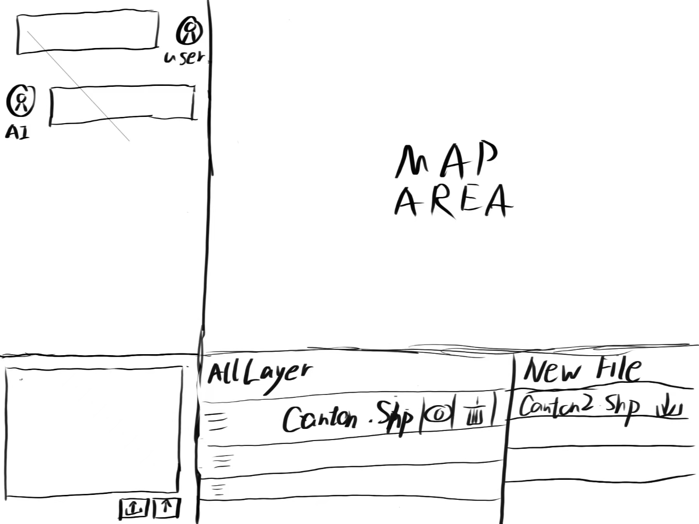
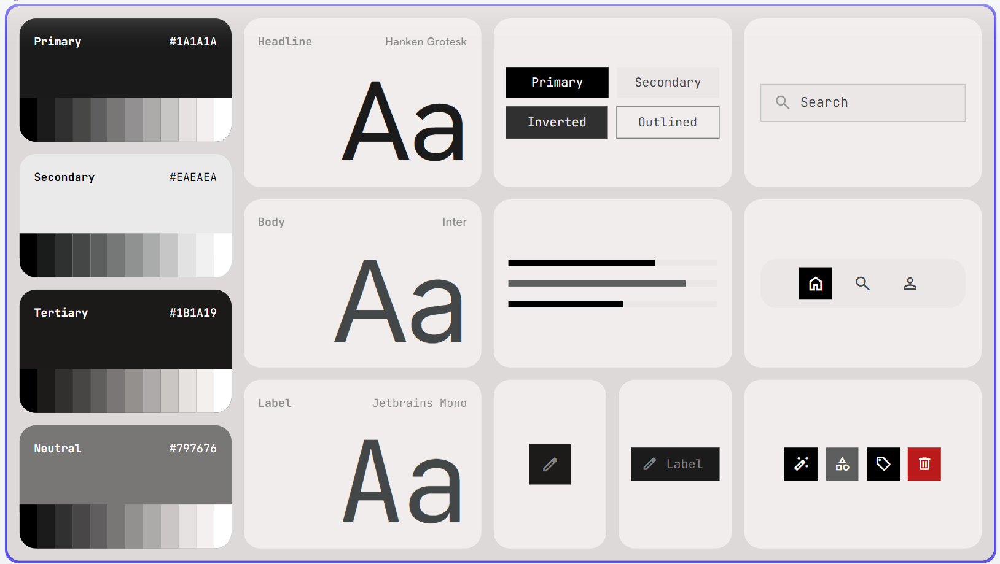

<p align="center">
  
</p>

<p align="center">
  GIS WORKTABLE
</p>

> 更新时间：2026-07-03

## 项目简介

GIS WorkTable 是一个基于 Web 的 GIS 数据处理可视化工作台，内置 AI 助手（DeepSeek Chat），支持自然语言交互。

## 设计演进

<p align="center">
  
</p>

<p align="center">
  <br>
  <a href="DESIGN.md">色彩方案配置</a>
</p>

<p align="center">
  
</p>

利用 Google Stitch 设计界面，已完成前端界面骨架搭建及 AI 对话接入。

### 已完成功能

- **AI 智能对话** — 左侧聊天面板接入 DeepSeek Chat，支持自然语言问答
- **对话记忆** — AI 能记住上下文，支持多轮连续对话，支持清除记忆
- **GIS 问答** — 回答地理信息、地图、空间分析相关问题
- **Leaflet 地图** — Bing Maps 中国区底图（三种样式：标准/无文字/卫星），WGS84
- **地图定位** — 浏览器定位 + 脉冲蓝点显示当前位置
- **底图切换** — 🗺 按钮循环切换不同底图
- **图层管理** — 图层列表（颜色标记、显隐、删除）
- **图层颜色** — 点击颜色圆点弹出颜色选择器，地图图层颜色同步变化
- **文件上传** — 上传 GeoJSON 文件显示到地图 + 自动加入图层列表
- **新建会话** — ＋ 按钮清除对话记忆，回到初始问候界面

### 界面预览

<p align="center">
  
</p>

## 快速开始

### 前端

直接用浏览器打开 `frontend/index.html`（或使用 Live Server）。

### 后端

```bash
# 1. 配置 API Key
echo "your-deepseek-api-key" > apikey.txt

# 2. 安装依赖
cd backend
pip install -r requirements.txt

# 3. 启动服务
cd ..
python -m uvicorn backend.main:app --reload --port 8000
```

> 前端默认连接 `http://localhost:8000`，确保后端先启动。

## 目录结构

```
Gis-WorkTable/
├── frontend/
│   ├── index.html          # 主页面
│   ├── css/style.css       # 全部样式
│   ├── js/
│   │   ├── api.js          # API 接口层（前后端通信）
│   │   ├── app.js          # 应用入口
│   │   ├── map.js          # 地图模块（Leaflet）
│   │   ├── chat.js         # 聊天界面模块
│   │   ├── layers.js       # 图层管理
│   │   ├── upload.js       # 文件上传
│   │   └── time.js         # 时间问候
│   └── assets/icons.svg    # SVG 图标 sprite
├── backend/
│   ├── main.py             # FastAPI 应用入口
│   ├── requirements.txt    # Python 依赖
│   └── services/
│       └── ai_service.py   # AI 对话服务（DeepSeek）
├── apikey.txt              # API Key（已加入 .gitignore）
├── DESIGN.md               # 色彩方案文档
└── README.md
```

## 技术栈

- **前端**：原生 HTML + CSS（无框架）
- **地图**：Leaflet 1.9.4 + Bing Maps 中国区底图（可选 Carto / OSM / 地形图 / 卫星图）
- **后端**：FastAPI（Python）
- **AI**：DeepSeek Chat API（OpenAI 兼容接口）
- **图标**：纯内联 SVG symbol sprite

## 未来规划

- [ ] AI 智能体（Function Calling）— AI 直接操作 GIS 数据
- [ ] 文件上传后端接入
- [ ] 多图层叠加分析
- [ ] 属性表查看与编辑
- [ ] 坐标系投影转换
- [ ] 结果导出（GeoJSON / Shapefile）
- [ ] 支持栅格数据与遥感影像

## 免责声明

本项目使用 Bing Maps 中国区（ditu.live.com）作为默认底图。地图数据由 Microsoft 必应地图提供，数据可能存在误差或不准确的情况，请使用者自行甄别。本项目中地图仅供学习参考，不构成任何专业的地理信息依据。
