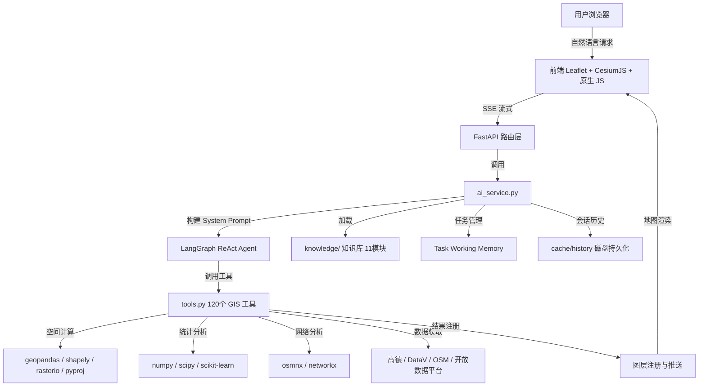

<p align="center">
  
</p>

<p align="center">
  <b>AI 驱动的智能 GIS 工作平台</b>
</p>

<p align="center">
  
  
  
  
  
  
</p>

> 项目持续开发中，部分功能仍在测试，可能存在已知或未发现的 Bug。使用前请阅读免责声明。

## 项目简介

GIS-WORKTABLE 是一个 AI 驱动的 GIS 工作平台：用自然语言描述需求，AI Agent 自动规划流程、调用 120 个专业 GIS 工具执行，结果在 2D 地图 / 3D 地球上呈现。所有功能同时提供手动操作入口，不依赖 AI 也能完成完整工作流。

***

## 核心功能

### AI Agent 智能助手

- 自然语言解析 GIS 需求，自动规划任务、选择方法、调用工具，多轮上下文记忆
- 120 个专业 GIS 工具：矢量分析、栅格处理、空间统计、网络分析、数据获取、编辑、制图、卷帘对比、云原生格式（COG/PMTiles/GeoParquet/FlatGeobuf）流式加载
- 知识库自动路由：11 个结构化 GIS 知识模块辅助方法选择与参数决策
- 下载数据前两阶段选项确认（先选数据源，再选具体数据），选项回传后自动回填原始任务上下文
- **结果真实性自检**：每轮结束后确定性核对磁盘与内存产物（文件是否存在、图层是否有数据），未通过的问题直接附在回复末尾，减少"声称成功"的假交付
- 地图定位（按图层名或经纬度飞行）、输出文件一键打开/下载、流式输出与取消

### 3D 地球与下钻浏览（2D/3D 双引擎）

- **2D/3D 一键切换**：Leaflet（2D）与 CesiumJS（3D，零 Cesium Ion 依赖）共享同一图层状态，图层增删、显隐、透明度、选中要素实时双向同步
- **行政区下钻导航**：全国 → 省 → 市 → 区县逐级下钻（DataV 边界，GCJ-02 自动校正为 WGS-84），面包屑导航、相机自动飞行；手动按钮与 AI 指令（`drill_down` / `drill_up`）均可驱动
- **数据驱动 3D 可视化**：按数值字段把面要素拉伸成立柱（如人口/GDP 对比），自动归一化着色；手动在图层检查器配置，或直接对 AI 说「把各市人口拉成柱子」（`visualize_3d` 工具）
- **2D 符号化同步 3D**：分级色彩、唯一值、分级符号、比例符号的颜色按要素同步到 3D
- **3D 常驻控件**：底图切换（影像/街道/深色）、复位视角、视图书签（2D/3D 通用，跨模式自动切换）
- 空间分析、图层透明度等 2D 功能在 3D 模式下同样可用，分析结果自动加载到两种视图

### 手动 GIS 操作（不依赖 AI）

- **工具直连通道**：`/api/tools/invoke` 直接调用注册工具（不经 LLM），空间分析/栅格/统计/数据获取全部有实体面板，44 个斜杠命令直连、无 API Key 也能完成完整工作流；AI 只负责长任务调度与开放性问答
- **卷帘对比（Swipe）**：两个图层左右/上下分割对比，分割线可拖动，图层面板两键开启、AI 指令（`create_swipe`）亦可驱动
- **处理历史与重跑**：每次工具执行（含手动直连）自动记录工具名/参数/产物/成败并持久化，右侧历史面板按时间倒序展示，支持一键重跑（产物作为新图层上图，不覆盖原图层）与复制参数 JSON
- 绘制：点/线/面/矩形/圆/标记，顶点编辑、捕捉
- 测量：距离、面积
- 图层管理：分组、拖拽排序、显隐、透明度滑块、重命名、导出 GeoJSON/Shapefile
- 符号化面板：唯一值/分级色彩/分级符号/比例符号 + 色带 + 类别预览 + 图例
- 属性表：编辑、筛选、空值填充、CSV 导出、要素定位
- 空间分析面板：缓冲区（含多环）、叠置（相交/联合/差集/裁剪）、质心/简化/融合/聚类/泰森多边形/分解多部件/几何互转、空间选择/属性选择/近邻/采样、字段统计/面积量测/空间连接/分区统计、行政区边界/POI/地震/天气/路网一键获取
- 空间统计面板、网络分析面板、栅格与工具面板（坡度/坡向/山体阴影/等高线/NDVI/栅格计算器/插值/水文/拓扑/坐标转换）、底图切换（Bing/Esri/白底）

### 空间分析与统计

- 矢量分析：缓冲区、叠加分析、融合、简化、质心、空间连接、邻近分析、聚类、Voronoi 图等
- 空间统计：Moran's I 全局/局部自相关、Getis-Ord Gi\* 热点分析、核密度估计（KDE）
- 网络分析：基于 OSM 路网的最短路径、服务区分析、路网下载
- 编辑与数据质量：移动/旋转/缩放、字段管理、几何修复、重复检测、拓扑检查

### 栅格与遥感

- 遥感指数：NDVI / NDWI / NDBI / EVI / NDMI（支持按传感器自定义波段）
- DEM 地形分析：高程、坡度坡向、山体阴影、等高线、地形剖面、水文分析
- 栅格计算器、栅格裁剪、空间插值
- **卫星影像智能巡检**：免下载原始遥感数据，直接用卫星瓦片（Esri/Bing/高德三源自动回退）对目标区域做水体/植被/裸地/建筑的 RGB 启发式初筛，输出分类叠加图、矢量图层与面积占比统计（算法思路参考 [GeoHarness](https://github.com/Star-Learning/GeoHarness)，MIT License，扩展实现为本项目自研）

### 数据获取与连接器

- **云原生格式流式加载**：COG（/vsicurl 降采样预览）、PMTiles（HTTP Range 按需读瓦片，MVT 解码上图）、GeoParquet / FlatGeobuf（pyogrio + BBOX 空间过滤/行数上限）；粘贴 URL、拖拽文件、AI 指令三入口
- 高德地图：POI 搜索、地理编码/逆地理编码/批量地理编码
- DataV 行政区划边界、OSM 开放数据发现与下载、USGS 地震、Open-Meteo 天气
- 连接器管理：11 个数据平台账号配置（Copernicus、USGS、地理空间数据云等）
- **凭据安全（Credential Injection）**：密码 Fernet 加密存储，登录工具只返回成功/失败，LLM 全程接触不到明文密码

### 制图与工程

- 图例、标注、指北针、热力图、统计图表、时间动画
- 静态地图导出（matplotlib，含标题/图例/指北针/比例尺，150/300 DPI）、地图导出图片/PDF
- 工程保存/加载/导入/导出，分析报告自动生成（Markdown）
- DAG 工作流引擎：Agent 可生成结构化工作流并执行
- 网络代理设置：支持系统代理自动检测，海外数据源国内可直连

### MCP Server 与质量守卫

- **MCP Server**（`python -m backend.services.mcp_server`）：stdio 传输，把全部 @tool 工具以 tools_list / tool_call / list_layers / get_task_status 四个 MCP 工具开放给 Claude Code、Cursor 等外部客户端；注册表自动反射、图层产物落盘会话目录、路径白名单 confinement（`GEOWORKTABLE_MCP_ROOTS`），配置示例见 [docs/mcp_server.md](docs/mcp_server.md)
- **地理质量自检（Geo QA）**：图层出通道时自动体检——CRS 未转换/经纬颠倒、空结果、无效几何、退化多边形变成显式警告而非静默错误
- **E2E 测试**：伪造数据经 HTTP 走完整直连链（缓冲→裁剪→统计→分区统计→卷帘→历史重跑），浏览器级 UI 链路可重放

***

## 技术架构


```mermaid
graph TB
    User[用户浏览器] -->|自然语言请求| Frontend[前端 Leaflet + CesiumJS + 原生 JS]
    Frontend -->|SSE 流式| API[FastAPI 路由层]
    API -->|调用| AIService[ai_service.py]
    AIService -->|构建 System Prompt| Graph[LangGraph ReAct Agent]
    AIService -->|加载| KB[knowledge/ 知识库 11模块]
    Graph -->|调用工具| Tools[tools.py 120个 GIS 工具]
    Tools -->|空间计算| GeoStack[geopandas / shapely / rasterio / pyproj]
    Tools -->|统计分析| StatsStack[numpy / scipy / scikit-learn]
    Tools -->|网络分析| NetworkStack[osmnx / networkx]
    Tools -->|数据获取| DataSources[高德 / DataV / OSM / 开放数据平台]
    Tools -->|结果注册| LayerState[图层注册与推送]
    LayerState -->|地图渲染| Frontend
    AIService -->|任务管理| TaskManager[Task Working Memory]
    AIService -->|会话历史| History[cache/history 磁盘持久化]
```

前端以 `gis_state.js` 为唯一 GIS 状态源（图层/选中/下钻栈），Leaflet 与 CesiumJS 渲染器只订阅状态事件——2D/3D 同步的是数据状态，不是各自维护一份。

### 模块说明

| 模块 | 位置 | 职责 |
| --- | --- | --- |
| 前端 | `frontend/` | Leaflet 2D + CesiumJS 3D、聊天界面、图层管理、设置面板、工程管理 |
| 共享状态 | `frontend/js/gis_state.js` | 图层/选中/下钻栈唯一数据源，2D/3D/UI 事件同步中枢 |
| 3D 渲染器 | `frontend/js/renderer_cesium.js` | CesiumJS 懒加载（零 Ion）、图层同步、拾取、下钻 UI、视图书签 |
| API 层 | `backend/main.py` | FastAPI 路由、静态文件、文件上传、工程管理接口 |
| AI 服务 | `backend/services/ai_service.py` | System Prompt 构建、知识库路由、会话管理、流式响应 |
| Agent 引擎 | `backend/services/graph.py` | LangGraph ReAct 循环、工具调用、简单文本短路 |
| GIS 工具 | `backend/services/tools.py` | 120 个 @tool 函数，覆盖全部 GIS 能力 |
| 知识库 | `knowledge/` | 11 个结构化 GIS 知识模块 |
| 任务管理 | `backend/services/task_manager.py` | Task Working Memory、产物与执行日志 |
| 待确认动作 | `backend/services/pending_action.py` | 跨轮 pending 状态、选项确认、上下文回填 |
| 结果真实性自检 | `backend/services/result_guard.py` | 确定性核对磁盘/内存产物，拦截假交付 |
| 坐标转换 | `backend/services/geo_coords.py` | WGS84 ↔ GCJ-02 ↔ Web Mercator，DataV 边界校正 |
| 凭据存储 | `backend/services/credential_store.py` | Fernet 加密存储、Credential Injection 模式 |
| 工具直连 | `POST /api/tools/invoke` | 手动面板通道：不经 LLM 直接执行 @tool，产物走同一图层通道并自动进历史 |
| 处理历史 | `backend/services/history_service.py` | 工具执行记录（名称/参数/产物/成败）持久化，支持按编号重跑 |
| 云原生加载 | `backend/services/cloud_native.py` | COG / PMTiles / GeoParquet / FlatGeobuf 流式读取助手 |
| 地理质量自检 | `backend/services/geo_qa.py` | 图层出口体检：CRS/坐标范围/几何有效性/空结果警告 |
| MCP Server | `backend/services/mcp_server.py` | stdio MCP，工具开放给外部 AI 客户端，路径 confinement |
| 桌面客户端 | `desktop/` | Electron 外壳：自动拉起/复用后端并加载前端 |

### 模块源码导读

- [task_manager_README.md](backend/services/task_manager_README.md) — 任务管理（TaskManager）模块说明

***

## 技术栈

**后端**：Python 3.11+、FastAPI + Uvicorn、LangGraph 1.x + LangChain 1.x、geopandas / shapely / rasterio / pyproj / pyogrio、numpy / scipy / scikit-learn / pandas、osmnx / networkx、matplotlib / seaborn / pyecharts

**前端**：原生 HTML / CSS / JavaScript（无构建工具）、Leaflet 1.9、CesiumJS 1.119（懒加载，本地 vendor 优先 + CDN 回退）、Marked.js

**AI 模型**：兼容 OpenAI 接口的任意模型（DeepSeek、GLM、Qwen 等），用户在设置中自行配置 API Key 和 Base URL

**工程化**：pytest 492 项（487 passed + 5 skipped），含工具注册完整性守卫、图层通道静态守卫（AST 扫描）与 FastAPI TestClient 接口级集成测试；另有云原生格式公开 URL 集成测试（无网络环境自动跳过）

***

## 项目结构

```
Gis-WorkTable/
├── backend/
│   ├── main.py                  # FastAPI 入口，路由与静态文件
│   ├── requirements.txt         # Python 依赖
│   └── services/
│       ├── ai_service.py        # AI 服务：System Prompt、知识库、会话管理
│       ├── graph.py             # LangGraph ReAct Agent 循环
│       ├── tools.py             # 120 个 GIS 工具函数
│       ├── task_manager.py      # Task Working Memory
│       ├── pending_action.py    # 跨轮待确认动作与选项
│       ├── result_guard.py      # 结果真实性自检（确定性）
│       ├── datav_service.py     # DataV 行政边界获取 + GCJ-02 校正
│       └── ...
├── frontend/
│   ├── index.html               # 单页应用入口
│   └── js/                      # 18 个前端模块
│       ├── gis_state.js         # 共享 GIS 状态中枢（2D/3D 同步核心）
│       ├── renderer_cesium.js   # CesiumJS 3D 渲染适配器
│       ├── map.js               # Leaflet 2D 地图
│       ├── chat.js              # 聊天与 SSE 流式接收
│       ├── layers.js            # 图层管理（检查器/符号化/属性表）
│       ├── spatial.js           # 空间分析面板
│       └── ...
├── knowledge/                   # GIS 专业知识库（11 模块）
├── docs/                        # 项目文档（3D 调研、UI 学习笔记等）
├── desktop/                     # Electron 桌面客户端外壳
├── cache/                       # 会话历史与 pending 状态
├── start.bat                    # Windows 一键启动（Web）
└── start-desktop.bat            # Windows 一键启动（桌面客户端）
```

***

## 安装与运行

**环境要求**：Python 3.11+，推荐 8GB 以上内存，一个兼容 OpenAI 接口的模型 API Key。

### Windows 一键启动

```cmd
start.bat             :: Web 版：自动拉起后端并打开浏览器（8000 端口已运行则直连）
start-desktop.bat     :: 桌面客户端（Electron），首次运行前需在 desktop/ 下 npm install
backend\run.bat       :: 后端独立开发调试（--reload 热重载）
stop.bat              :: 停止后台服务
run_tests.bat         :: 运行全量 pytest 测试
```

### 手动安装

```bash
git clone https://github.com/Wukeeeeee/GIS-WORKTABLE.git
cd GIS-WORKTABLE
pip install -r backend/requirements.txt
cd backend
uvicorn main:app --host 127.0.0.1 --port 8000 --reload
```

启动后浏览器打开 `http://127.0.0.1:8000`。

### 配置

- **AI 模型**：左下角设置 → 「AI 模型」→ 添加 Provider（名称、API Key、Base URL、模型名）。API Key 只存浏览器 localStorage，不上传服务器
- **数据连接器**：输入框旁连接器图标或设置 → 连接器，配置数据平台账号后状态会显示在数据源选择中

***

## 使用示例

| 你说 | AI 做 | 得到 |
| --- | --- | --- |
| 对广州塔周边 2 公里的 POI 做缓冲区分析 | 高德地理编码 → POI 搜索 → 缓冲区 → 空间相交统计 | 缓冲区 + POI 分布图 + 统计解读 |
| 计算这个区域的 NDVI | 检查多波段栅格 → ndvi_analysis → 分级统计 | NDVI 伪彩色图 + 植被覆盖统计 |
| 分析这些事件的空间聚集模式 | Moran's I 判断聚集 → Getis-Ord Gi\* 找热点 | 热点图 + 显著性解释 |
| 巡检武汉市洪山区的卫星影像 | DataV 边界 → 三源瓦片回退下载 → RGB 分类 | 分类叠加图 + 矢量图层 + 面积占比 |
| 帮我下载广州的 Sentinel-2 影像 | 弹出数据源选择 → 检索 → 弹出影像列表 → 下载 | 影像加载到地图 + 元信息 |
| 把湖南省各市人口在 3D 上拉成柱子 | visualize_3d 工具按字段拉伸着色 | 3D 立柱对比图（切到 3D 查看） |
| 下钻到长沙市看区县 | drill_down 加载下一级边界 | 逐级下钻浏览 + 面包屑导航 |

***

## 开发说明

### 运行测试

```bash
cd backend
python -m pytest tests/ -v
```

当前收集 492 项：487 项通过，5 项远程集成测试在无网络环境自动跳过。覆盖范围：工具注册完整性守卫、图层通道静态守卫、结果真实性自检、下钻与 3D 可视化、知识库加载、空间分析、栅格工具、网络分析、空间统计、遥感指数、任务管理、坐标转换、Workflow 引擎、凭据安全等。

### 新增 GIS 工具

1. 在 `backend/services/tools.py` 添加 `@tool` 函数（docstring 含适用场景、输入要求、输出说明）
2. 工具名加入 `tools` 列表
3. 图层结果必须经 `_push_layer` / `_register_layer` 输出（有静态守卫测试）
4. 添加对应测试用例

### 调试

- 后端日志：控制台实时输出
- AI 执行步骤：聊天界面展开「思考过程」与工具调用日志
- 会话历史：`cache/history/`；任务文件：`cache/tasks/`

### 相关文档

- [docs/research_3d_globe_drilldown.md](docs/research_3d_globe_drilldown.md) — 3D 地球/下钻技术调研与架构设计
- [docs/geolibre_ui_learnings.md](docs/geolibre_ui_learnings.md) — GeoLibre 手动交互与性能优化学习笔记

***

## 已知限制

- **结果真实性自检覆盖有限**：只核对已知输出目录内的文件路径、图片 URL 与图层数据；纯语言描述的"已完成"无法判定
- **遥感自动下载需自行配置账号**：Copernicus / USGS 目前提供检索与认证指引，未实现 OAuth 自动换取凭据
- **DEM 分析依赖上传的 GeoTIFF**：不内置公开 DEM 自动下载
- **网络分析受 OSM 数据质量影响**：大区域路网下载耗时明显
- **桌面客户端为实验性**：仅在 Windows 人工验证，Python 依赖本机环境
- **会话与任务状态存本地**（`cache/`）：清理该目录会丢失历史与挂起动作
- **GeoJSON 上下文有截断**：随消息附带的图层超过 8000 字符会被截断，超大图层建议先简化或抽样
- **3D 地形为椭球面**：未接入真实 DEM 地形（规划中），3D 拉伸可视化仅支持面图层

***

## 免责声明

本项目处于持续开发阶段，可能存在已知或未发现的 Bug。GIS 分析结果仅供参考，不构成任何专业决策依据。请注意：

- 分析结果的准确性取决于输入数据质量与方法选择；坐标转换和空间计算可能存在精度误差
- 卫星影像巡检是基于 RGB 颜色特征的启发式初筛，不等同于专业遥感分类，相近颜色地物（如偏绿的高含沙水体）存在误判风险，重要结果需人工核验
- 卫星瓦片来源为 Esri World Imagery、Bing Maps 和高德地图，版权归原作者所有，本项目仅用于本地研究和学习，不得用于商业用途或大规模抓取
- 第三方数据平台的使用需遵守对应平台条款；AI 生成的解读不替代专业 GIS 人员的判断

***

## License

AGPL-3.0
