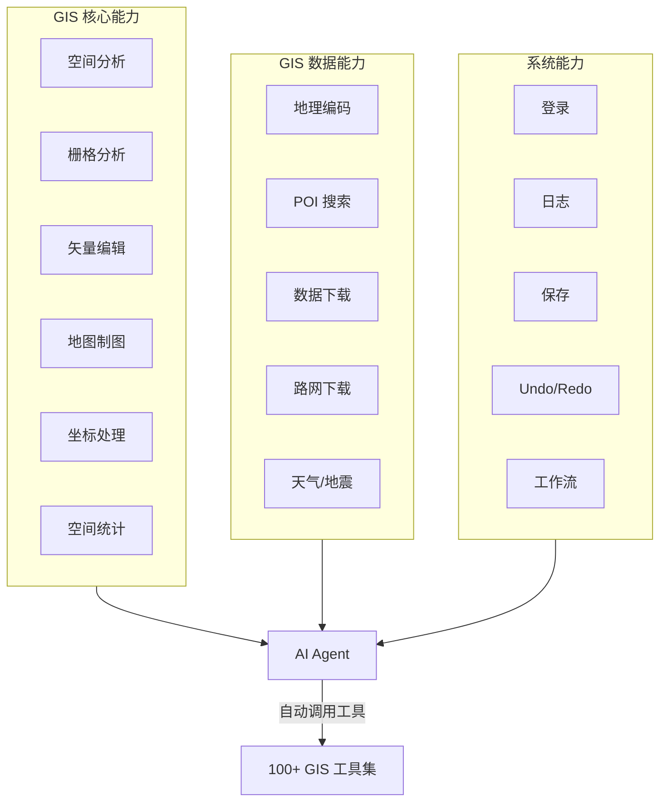
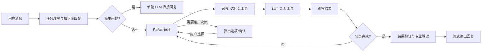

<p align="center">
  
</p>

<p align="center">
  <b>AI 驱动的智能 GIS 工作平台</b>
</p>

<p align="center">
  
  
  
  
  
</p>

> 项目持续开发中，部分功能仍在测试，可能存在已知或未发现的 Bug。使用前请阅读免责声明。

---

## 项目简介

GIS-WORKTABLE 是一个面向 GIS 专业人员的 AI 智能工作平台。它将 AI Agent、GIS 专业知识库、空间分析工具链和自动化工作流整合为一体，让用户通过自然语言即可完成空间数据获取、坐标转换、空间分析、遥感指数计算、地图制图和分析报告生成。

与传统 GIS 软件相比，GIS-WORKTABLE 的核心差异在于：用户不需要记住复杂的工具菜单和参数配置，只需用自然语言描述需求，AI Agent 会自动理解任务、规划分析流程、调用专业 GIS 工具执行，并对结果给出专业解读。

**目标用户**：GIS 分析师、遥感工程师、城市规划师、地理数据科学家、需要处理空间数据的研究人员和开发者。


***

## 核心功能

### AI Agent 智能助手


* 自然语言 GIS 需求解析：自动识别分析目标、数据需求和方法选择

* 任务规划：复杂任务自动分解为数据准备、数据检查、方法选择、工具调用、结果验证、结果展示的完整流程

* 101 个专业 GIS 工具调用：覆盖矢量分析、栅格处理、空间统计、网络分析、数据获取等领域

* 多轮上下文记忆：支持 Task Working Memory、会话历史、中间结果管理和长任务执行

* 结果专业解读：对分析结果给出统计数据、空间分布特征和方法局限性说明

* 两阶段数据源选择：下载数据前先让用户选数据源（带配置状态），搜索后再让用户选具体数据

* **选项上下文回填**：用户点击选项后前端只会回一个短标签，原任务描述（尤其是地名）不在当前消息里。
  系统由确定性逻辑把弹出选项时的原始请求拼回，避免模型据此编造任务对象（"用户说上海、却巡检了北京"）

* **结果真实性自检**：一轮结束后确定性核对磁盘与内存状态——正文声称的产物文件路径是否真实存在、
  待推送图片 URL 是否有对应文件、图层是否有矢量数据。未通过时把问题直接追加到回复末尾，
  而不是让一个"看起来成功"的结果交付给用户（纯规则校验，无额外 LLM 调用）

* 完整 GIS Agent 模式：走 ReAct Agent 流程（工具调用、多轮推理、流式输出），简单问题自动 bypass 减少 token 开销（原 Fast/Full 双模式因上下文污染漏洞已移除，统一为完整模式）

* 地图定位交互：`focus_map` 工具支持按图层名（模糊匹配）或经纬度把地图视野飞到指定位置，zoom 自动夹到 3-19 防止越界白屏

* 产出文件一键打开/下载：AI 回复中出现的输出文件路径自动渲染「打开 / 下载」按钮

### GIS 专业知识库


* 11 个结构化知识模块：GIS 基础、坐标系与投影、矢量处理、栅格处理、空间分析、空间统计、遥感分析、DEM 地形分析、地图制图规范、常见 GIS 项目工作流

* 每个模块包含适用场景、输入数据要求、分析思路、处理流程、方法选择依据、推荐工具、输出结果、常见问题

* Agent 自动路由匹配：根据用户任务自动加载相关知识模块，辅助方法选择和参数决策

### 空间分析工具链


* 矢量分析：缓冲区、多环缓冲区、叠加分析（相交 / 联合 / 差集 / 裁剪）、融合、简化、质心、空间连接、要素选择、采样、邻近分析、聚类分析、Voronoi 图、字段统计

* 编辑操作：移动、旋转、缩放、顶点编辑、添加字段、删除字段、更新属性、删除要素

* 坐标转换：坐标系转换、坐标批量转换

* 数据质量：几何有效性批量修复、重复要素检测、拓扑检查

### 栅格与遥感分析


* 遥感指数：NDVI（归一化植被指数）、NDWI（归一化水体指数）、NDBI（归一化建筑指数）、EVI（增强型植被指数）、NDMI（归一化水分指数）

* 栅格计算：自定义栅格计算器、栅格裁剪、空间插值

* DEM 地形分析：高程分析、地形剖面、等高线提取、三维地形查看

* **卫星影像智能巡检**：无需下载原始遥感数据，直接使用卫星瓦片（Esri World Imagery / Bing 中国区 / 高德卫星图，三源自动回退），对指定区域进行水体 / 植被 / 裸地 / 建筑的 RGB 启发式初筛，生成半透明分类叠加图（overlay PNG）和矢量结果图层，输出各类别面积（等面积投影 EPSG:6933）、占比统计，并在结果图上用 PIL 叠加图例与指北针。占比口径为「该类像素数 / 总分析像素数」且各类独立计算，混合像元、阴影、未识别地物不计入任何类别，因此各类占比合计通常不足 100%。支持系统代理自动检测，Esri 访问失败时自动回退 Bing，Bing 失败时回退高德（国内直连）

> 卫星巡检算法参考了开源项目 
>
> [GeoHarness](https://github.com/Star-Learning/GeoHarness)
>
> （MIT License）的 RGB 颜色阈值启发式分类思路，本项目在此基础上扩展了多源瓦片回退、代理支持、矢量结果注册、overlay 可视化等能力。
> 感谢 DeepSeek Harness 开源项目及其相关工程实践。本项目在 Agentic GIS 的相关设计与工程实现方面参考了其中的一些思路。

### 空间统计


* 全局空间自相关（Moran's I）：判断空间数据是否存在聚集模式。显著性用 Cliff & Ord 随机化假设下的方差计算；
  样本量过小或权重结构不满足正态近似时自动改用 199 次置换检验，并在结果里写明用的是哪种方式

* 局部空间自相关与热点分析（Getis-Ord Gi\*）：识别热点和冷点区域

* 核密度估计（KDE）：分析点要素的空间分布密度。带宽参数单位是**度**（WGS84），不指定时按 Scott 法则自动估算；
  只接受点图层（面/线会提示先取质心，避免算成"顶点密度"）；同时输出「点/平方度」与「点/平方千米」两种口径

### 网络分析


* 路径规划：基于 OSM 路网的最短路径计算

* 服务区分析：网络可达范围计算

* 路网下载：按区域自动下载 OpenStreetMap 道路网络

### 数据获取与连接器


* 高德地图：POI 搜索、地理编码、逆地理编码、批量地理编码

* DataV：行政区划边界获取

* 开放数据发现与下载：自动检索公开 GIS 数据源（道路、建筑、POI、水系、土地利用、遥感影像、DEM 等）并下载加载

* 卫星瓦片直连：Esri World Imagery（全球覆盖）、Bing 中国区卫星影像、高德卫星图（国内直连），三源自动回退，无需 API Key，支持巡检工具直接调用

* Shapefile 上传：`.shp` 文件已进入上传白名单

* 天气数据：Open-Meteo 免费 API，无需 Key，支持任意坐标的温度、降水、风速等时序数据查询与趋势图生成

* 地震数据：USGS 免费 API，无需 Key，支持按时间、区域、震级检索地震数据并加载到地图，可继续做热点 / 缓冲区分析

* 连接器管理：支持 11 个数据平台的账号配置（Copernicus、USGS、地理空间数据云、NASA Earthdata、OpenTopography、ASF、天地图、资源环境数据云等），配置状态实时可见

* **安全凭据管理（Credential Injection）**：账号密码加密存储在本地，Agent 只能调用 `login_xxx()` 工具，**LLM 无法读取、获取或输出明文密码**。登录工具内部自动读取凭据，返回值只包含 `{success: true/false}`，不包含密码、Cookie、Token 等敏感信息

### 地图制图与可视化


* 分级色彩图、唯一值图、热力图、统计图表（柱状图、折线图等）

* 图例、标注、指北针添加

* 地图导出为图片或 PDF

* 时间动画、图表地图联动

* **静态地图导出**（generate\_static\_map）：基于 matplotlib + geopandas 生成含标题、图例、指北针、比例尺、网格的研究区地图，支持 150/300 DPI 高分辨率输出，无需额外依赖

### 工程与项目管理


* 工程保存 / 加载 / 重命名 / 删除 / 导出 / 导入

* 图层管理：添加、删除、显隐控制、属性查看、导出 Shapefile

* 分析报告自动生成：包含方法、参数、结果统计和结论的 Markdown 报告

* **GIS Workflow 工作流引擎**：支持 DAG 工作流定义、节点依赖解析、顺序执行、状态追踪，Agent 可生成结构化工作流并调用 execute\_workflow 工具执行

* **网络代理设置**：独立面板配置 HTTP/HTTPS 代理（支持系统代理自动检测），卫星瓦片下载和外部 API 请求自动走代理，国内用户无需全局代理即可访问 Esri/Bing 等海外数据源


***

## 技术架构


```mermaid
graph TB
    User[用户浏览器] -->|自然语言请求| Frontend[前端 Leaflet + 原生 JS]
    Frontend -->|SSE 流式| API[FastAPI 路由层]
    API -->|调用| AIService[ai_service.py]
    AIService -->|构建 System Prompt| Graph[LangGraph ReAct Agent]
    AIService -->|加载| KB[knowledge/ 知识库 11模块]
    Graph -->|调用工具| Tools[tools.py 100个 GIS 工具]
    Tools -->|空间计算| GeoStack[geopandas / shapely / rasterio / pyproj]
    Tools -->|统计分析| StatsStack[numpy / scipy / scikit-learn]
    Tools -->|网络分析| NetworkStack[osmnx / networkx]
    Tools -->|数据获取| DataSources[高德 / DataV / OSM / 开放数据平台]
    Tools -->|结果注册| LayerState[图层注册与推送]
    LayerState -->|地图渲染| Frontend
    Graph -->|待确认动作| PendingAction[pending_action 持久化]
    AIService -->|任务管理| TaskManager[Task Working Memory]
    AIService -->|会话历史| History[cache/history 磁盘持久化]
```

### 能力分层架构

GIS-WORKTABLE 的能力分为三层，由 AI Agent 统一调度：


```mermaid
graph TB
    subgraph Core["GIS 核心能力"]
        C1[空间分析]
        C2[栅格分析]
        C3[矢量编辑]
        C4[地图制图]
        C5[坐标处理]
        C6[空间统计]
    end

    subgraph Data["GIS 数据能力"]
        D1[地理编码]
        D2[POI 搜索]
        D3[数据下载]
        D4[路网下载]
        D5[天气/地震]
    end

    subgraph System["系统能力"]
        S1[登录]
        S2[日志]
        S3[保存]
        S4[Undo/Redo]
        S5[工作流]
    end

    Core --> Agent[AI Agent]
    Data --> Agent
    System --> Agent
    Agent -->|自动调用工具| Tools[100+ GIS 工具集]
```

- **GIS 核心能力**：空间分析（缓冲区/叠加/网络分析等）、栅格分析（遥感指数/DEM/栅格计算）、矢量编辑、地图制图、坐标处理、空间统计（Moran's I/热点/KDE）
- **GIS 数据能力**：地理编码（高德/Open-Meteo）、POI 搜索、开放数据下载（OSM/Copernicus/USGS/地理空间数据云）、路网下载、天气/地震等专题数据
- **系统能力**：登录认证、操作日志、工程保存/加载、Undo/Redo、DAG 工作流引擎

### 模块说明


| 模块          | 位置                                     | 职责                                              |
| ----------- | -------------------------------------- | ----------------------------------------------- |
| 前端          | `frontend/`                            | Leaflet 地图、聊天界面、图层管理、设置面板、工程管理                  |
| API 层       | `backend/main.py`                      | FastAPI 路由、静态文件服务、文件上传、工程管理接口                   |
| AI 服务       | `backend/services/ai_service.py`       | System Prompt 构建、知识库路由、会话管理、流式响应                |
| Agent 引擎    | `backend/services/graph.py`            | LangGraph ReAct 循环、工具调用、简单文本短路                  |
| GIS 工具      | `backend/services/tools.py`            | 101 个 @tool 函数，覆盖全部 GIS 能力                     |
| 知识库         | `knowledge/`                           | 11 个结构化 GIS 知识模块                                |
| 任务管理        | `backend/services/task_manager.py`     | Task Working Memory、代码 / 产物 / 执行日志              |
| 待确认动作       | `backend/services/pending_action.py`   | 跨轮 pending 状态、选项确认、磁盘持久化                        |
| 开放数据        | `backend/services/data_discovery.py`   | 开放 GIS 数据源检索与下载                                 |
| Workflow 引擎 | `backend/services/workflow.py`         | DAG 工作流定义、节点依赖解析、顺序执行、状态追踪                      |
| 坐标转换        | `backend/services/geo_coords.py`       | WGS84 ↔ GCJ-02 ↔ Web Mercator 坐标转换，DataV 边界数据校正 |
| 凭据存储        | `backend/services/credential_store.py` | Fernet 加密存储、Credential Injection 模式             |
| 结果真实性自检    | `backend/services/result_guard.py`     | 确定性核对磁盘/内存产物，拦截"声称成功但未真实生成"  |
| 桌面客户端      | `desktop/`                             | Electron 外壳：自动拉起/复用 FastAPI 后端并加载前端        |

### 模块源码导读

- [task_manager_README.md](backend/services/task_manager_README.md) — 任务管理（TaskManager）模块说明

### AI Agent 内部流程



```mermaid
graph LR
    A[用户消息] --> B[任务理解与知识库匹配]
    B --> C{简单问题?}
    C -->|是| D[单轮 LLM 直接回复]
    C -->|否| E[ReAct 循环]
    E --> F[思考: 选什么工具]
    F --> G[调用 GIS 工具]
    G --> H[观察结果]
    H --> I{任务完成?}
    I -->|否| E
    I -->|是| J[结果验证与专业解读]
    J --> K[流式输出回复]
    E -->|需要用户决策| L[弹出选项/确认]
    L -->|用户选择| E
```


***

### 安全设计：Credential Injection 模式

本项目采用 Credential Injection（凭据注入）模式管理数据平台账号密码，核心原则是 **LLM 永远接触不到明文密码**：


```
用户在设置页面输入账号密码

    ↓

前端 → 后端 API → Fernet 加密存储到本地文件

    ↓

Agent 调用 login_gscloud()（无参数）

    ↓

工具内部从加密存储读取凭据 → 执行登录

    ↓

Agent 收到 {"success": true} 或 {"success": false, "reason": "..."}

    ↓

密码全程不进入 LLM Prompt、Agent Context、工具返回值、日志
```

**安全边界**：


| 组件                  | 能否读取明文密码               |
| ------------------- | ---------------------- |
| LLM / Agent         | 不能                     |
| login\_xxx () 工具返回值 | 不能（只返回 success/reason） |
| 工具内部函数              | 可以（用完即弃，不输出不记录）        |
| 前端 localStorage     | 有一份（用户自己输入的）           |
| 后端存储文件              | 加密存储，明文搜索不到密码          |
| 日志 / 错误信息           | 不记录密码                  |

Agent 可以知道：是否已配置凭据、登录是否成功、是否需要验证码、下载是否成功。

Agent 不可以知道：密码、Cookie、Session Token、Authorization Token。

## 工作流程


```
用户输入自然语言需求

    ↓

AI 理解任务，匹配知识库模块

    ↓

规划分析流程（数据准备 → 检查 → 方法选择 → 工具调用 → 验证 → 展示）

    ↓

调用 GIS 工具执行（可多轮工具调用）

    ↓

需要用户决策时弹出选项（数据源选择 / 数据选择 / 确认加载）

    ↓

生成地图、图表、分析报告

    ↓

AI 给出专业解读（统计数据、空间分布、方法局限性）
```


***

## 技术栈

**后端**


* Python 3.11+

* FastAPI + Uvicorn

* LangGraph 1.x + LangChain 1.x（AI Agent 引擎）

* geopandas、shapely、rasterio、pyproj、pyogrio（GIS 核心库）

* numpy、scipy、scikit-learn、pandas（数值与统计）

* osmnx、networkx（网络分析）

* matplotlib、seaborn、pyecharts（可视化）

* Pillow、scikit-image（图像处理）

**前端**


* 原生 HTML / CSS / JavaScript（无构建工具）

* Leaflet（交互式地图）

* Marked.js（Markdown 渲染）

**AI 模型**


* 兼容 OpenAI 接口的任意模型（DeepSeek、GLM、Qwen 等）

* 用户在设置中自行配置 API Key 和 Base URL

**工程化**


* pytest（294 项：293 passed + 1 skipped，其中 19 项为 FastAPI TestClient 接口级集成测试）


***

## 项目结构


```
Gis-WorkTable/

├── backend/

│   ├── main.py                  # FastAPI 入口，路由与静态文件

│   ├── requirements.txt         # Python 依赖

│   ├── pytest.ini               # 测试配置

│   ├── services/

│   │   ├── ai_service.py        # AI 服务：System Prompt、知识库、会话管理

│   │   ├── graph.py             # LangGraph ReAct Agent 循环

│   │   ├── tools.py             # 101 个 GIS 工具函数

│   │   ├── task_manager.py      # Task Working Memory

│   │   ├── pending_action.py    # 跨轮待确认动作与选项

│   │   ├── result_guard.py      # 结果真实性自检（确定性）

│   │   ├── data_discovery.py    # 开放数据发现与下载

│   │   └── ...

│   └── tests/                   # pytest 测试（294 项：293 passed + 1 skipped）

├── desktop/

│   ├── main.js                  # Electron 外壳：探测/拉起后端并加载前端

│   └── package.json

├── frontend/

│   ├── index.html               # 单页应用入口

│   ├── css/style.css            # 样式

│   └── js/                      # 18 个前端模块

│       ├── chat.js              # 聊天与 SSE 流式接收

│       ├── layers.js            # 图层管理

│       ├── map.js               # 地图操作

│       ├── settings.js          # 设置面板

│       ├── spatial.js           # 空间分析面板

│       ├── spatial_stats.js     # 空间统计面板

│       ├── connector.js         # 连接器快捷入口

│       ├── project.js           # 工程管理

│       └── ...

├── knowledge/                   # GIS 专业知识库（11 模块）

│   ├── 00_index.md

│   ├── 01_gis_basics.md

│   ├── 02_coordinate_systems.md

│   ├── 03_vector_processing.md

│   ├── 04_raster_processing.md

│   ├── 05_spatial_analysis.md

│   ├── 06_spatial_statistics.md

│   ├── 07_remote_sensing.md

│   ├── 08_dem_terrain.md

│   ├── 09_cartography.md

│   └── 10_workflows.md

├── docs/                        # 项目文档

├── skills/                      # 可复用 Skill

├── cache/                       # 会话历史与 pending 状态

├── data/                        # 下载的数据文件

├── reports/                     # 生成的分析报告

├── start.bat                    # Windows 一键启动

└── README.md
```


***

## 安装与运行

### 环境要求


* Python 3.11 或更高版本

* 推荐 8GB 以上内存（空间分析和栅格处理较为消耗资源）

* 一个兼容 OpenAI 接口的 AI 模型 API Key

### 方式一：一键启动（Windows）


```
start.bat
```

脚本会自动安装依赖并启动后端服务。

### 方式二：桌面客户端（Electron，实验性）

客户端会先探测 127.0.0.1:8000：后端已运行则直接复用，未运行则用本地 Python 拉起 uvicorn。

```
cd desktop

npm install

npm start
```

Python 路径可用环境变量 `GIS_PYTHON` 指定（找不到解释器时会弹窗提示）。

### 方式三：手动启动


```
\# 1. 克隆项目

git clone https://github.com/Wukeeeeee/GIS-WORKTABLE.git

cd GIS-WORKTABLE

\# 2. 安装 Python 依赖

pip install -r backend/requirements.txt

\# 3. 启动后端

cd backend

uvicorn main:app --host 127.0.0.1 --port 8000 --reload
```

### 访问

启动后在浏览器打开：`http://127.0.0.1:8000`

### 配置 AI 模型


1. 点击页面左下角模型选择器旁边的设置按钮

2. 在「AI 模型」页签中添加 Provider（名称、API Key、Base URL、模型名称）

3. 选中该 Provider 即可开始使用

4. API Key 保存在浏览器 localStorage，不会上传到服务器

### 配置数据源连接器


1. 点击输入框旁的连接器图标，或进入设置 → 连接器

2. 配置需要使用的数据平台账号（Copernicus、USGS、地理空间数据云等）

3. 配置状态会在 AI 下载数据时的数据源选择中显示


***

## 使用示例

### 示例 1：缓冲区分析

**用户输入**：


```
对广州塔周边 2 公里范围内的 POI 做缓冲区分析
```

**执行流程**：


1. AI 调用高德地理编码获取广州塔坐标

2. 调用高德 POI 搜索获取周边 POI

3. 调用 spatial\_buffer 工具生成 2 公里缓冲区

4. 调用 spatial\_intersect 统计缓冲区内 POI 数量

5. 渲染缓冲区和 POI 到地图

**输出结果**：地图显示缓冲区范围和 POI 分布，AI 回复包含 POI 数量统计和空间分布特征。

### 示例 2：遥感指数计算

**用户输入**：


```
计算这个区域的 NDVI 植被指数
```

**执行流程**：


1. AI 检查当前图层是否为多波段栅格

2. 调用 ndvi\_analysis 工具计算 NDVI

3. 生成 NDVI 伪彩色图

4. 统计植被覆盖等级分布

**输出结果**：NDVI 热力图 + 植被覆盖统计 + 方法说明。

### 示例 3：空间统计热点分析

**用户输入**：


```
分析这些犯罪事件的空间聚集模式，找出热点区域
```

**执行流程**：


1. AI 调用 spatial\_moran 计算全局 Moran's I，判断是否存在聚集

2. 调用 spatial\_hotspot 计算 Getis-Ord Gi\*，识别热点和冷点

3. 渲染热点图

**输出结果**：热点分布图 + Moran's I 统计值 + 显著性解释。

### 示例 4：路径规划

**用户输入**：


```
从广州东站到广州塔的最短驾车路线
```

**执行流程**：


1. AI 调用 download\_road\_network 下载区域路网

2. 调用 network\_analysis 计算最短路径

3. 渲染路线到地图

**输出结果**：地图显示最优路线 + 距离和预计时间。

### 示例 5：数据下载（两阶段选择）

**用户输入**：


```
帮我下载广州的 Sentinel-2 遥感影像
```

**执行流程**：


1. AI 调用 ask\_user\_choice 弹出数据源选项（显示各数据源配置状态）

2. 用户选择数据源后，AI 搜索可用影像

3. AI 再次调用 ask\_user\_choice 弹出候选影像列表（日期、云量、分辨率）

4. 用户选择后，AI 下载并加载到地图

**输出结果**：遥感影像加载到地图 + 数据元信息说明。

### 示例 6：卫星影像智能巡检

**用户输入**：


```
巡检武汉市洪山区的卫星影像
```

**执行流程**：


1. AI 调用 inspect\_satellite\_image 工具

2. 工具通过 DataV 获取洪山区行政边界

3. 自动下载 Esri（失败回退 Bing，再失败回退高德）卫星瓦片并拼接

4. 对影像进行 RGB 启发式分类（水体 / 植被 / 裸地 / 建筑）

5. 生成半透明分类叠加图（overlay PNG）推送到前端

6. 分类结果矢量化并注册为 GIS 图层加载到地图

7. 输出各类别像素数、面积（等面积投影）、占比统计

**输出结果**：地图显示原始卫星影像 + 半透明分类叠加层 + 矢量结果图层，AI 回复包含分类统计表格和方法局限性说明。


***

## 开发说明

### 运行测试


```
cd backend

python -m pytest tests/ -v
```

当前收集 294 项：293 项通过，1 项因缺少 GDAL 环境被跳过；其中 19 项为 FastAPI TestClient 发起的接口级集成测试。
覆盖范围：工具注册完整性守卫、结果真实性自检、焦点定位工具、知识库加载、空间分析工具、栅格工具、网络分析、空间统计、遥感指数、报告质量、多轮状态、任务管理、坐标转换、Workflow 引擎、开放数据发现、凭据安全、选项交互等。

### 新增 GIS 工具


1. 在 `backend/services/tools.py` 中添加 `@tool` 装饰的函数

2. 函数 docstring 需包含适用场景、输入要求、输出说明、常见问题

3. 将工具名加入 `tools` 列表

4. 添加对应测试用例

### 新增知识模块


1. 在 `knowledge/` 目录下添加 Markdown 文件

2. 在 `ai_service.py` 的 `_KNOWLEDGE_MAP` 中注册路由标签

3. 模块需包含适用场景、输入要求、分析思路、处理流程、方法选择依据、推荐工具、输出结果、常见问题

### 调试


* 后端日志：控制台实时输出

* AI 执行步骤：聊天界面中可展开「思考过程」和工具调用日志

* 会话历史：`cache/history/` 目录

* 任务文件：`cache/tasks/` 目录


***

## 最近更新

* **默认底图改为 Bing 卫星影像**（原默认 Esri World Imagery 国内需翻墙，新用户打开不再白屏；Esri 仍可在视图菜单手动切换，需配置代理）

* **修复 matplotlib 中文乱码**：抽取独立公共模块 `matplotlib_font.py`，统一中文字体检测（微软雅黑/SimHei/Noto Sans CJK 等 16 种候选字体 + 多级 fallback），主进程和 run_code 沙箱统一调用，所有图表中文正常显示

* **修复 Shapefile 导出空 ZIP**：geopandas 1.x `to_file()` 路径不带 `.shp` 扩展名时会创建子目录导致空 ZIP（22字节），已修复并增加导出真实性验证（ZIP存在/大小/包含.shp/.shx/.dbf/.prj，验证失败返回明确错误）

* **导出真实性验证机制**：为 GeoJSON/GPKG/CSV/csv_xy/Shapefile 全部 5 种导出格式增加验证（文件存在/大小合理/可被对应库重新读取/Feature数量与源一致/关键数据不丢失），验证失败 Tool 返回 success=false，禁止 Agent 幻觉声称导出成功

* **修复 Pylance 静态分析警告**：7 处 `from matplotlib import cm` 后直接使用 `matplotlib.colormaps` 改为 `import matplotlib`

* 新增 GIS 专业知识库（11 个结构化模块，Agent 自动路由匹配）

* AI Agent 能力升级：任务规划流程、结果专业解读、方法选择决策树

* 新增空间统计工具：Moran's I 全局 / 局部自相关、Getis-Ord Gi\* 热点分析、核密度估计

* 新增遥感指数工具：NDWI、NDBI、EVI、NDMI

* 新增分析报告自动生成、几何修复、重复要素检测工具

* 新增两阶段数据源选择机制（ask\_user\_choice + choose\_option）

* 新增连接器管理面板（11 个数据平台账号配置）

* 新增消息引用功能（引用 AI 回复继续对话）

* 新增空间统计前端面板

* 新增 Windows 一键启动脚本

* 取消自校验环节（减少一次 LLM 调用，提升响应速度）

* 优化简单文本响应速度（短路机制，避免简单问题走 ReAct 循环）

* 新增天气数据获取工具（Open-Meteo，免费无 Key，时序数据 + 趋势图）

* 新增地震数据获取工具（USGS，免费无 Key，地震点加载 + 震级分布直方图）

* 卫星影像巡检工具升级：Esri/Bing 双源自动回退、系统代理自动检测、默认 zoom 提升至 16、新增 overlay PNG 半透明分类叠加图输出

* 空间叠加分析工具（相交 / 差异 / 裁剪）返回真实面积和占比统计，AI 可直接引用数值做结果总结

* 数据源选择固定插入 "Esri 快速巡检" 选项（无需下载，立即可用）

* 修复底图初始化兼容、设置面板日志按钮作用域、巡检工具碎斑过滤等多项 Bug

**第二阶段优化（Agent 稳定性）**：


* 修复流式端点忽略 Fast/Full 模式的严重 Bug：此前流式请求总是走完整 Agent，Fast 模式完全失效；现在 run\_agent\_stream 支持 mode 参数，Fast 模式直接单轮 LLM 秒回

* 增加 LLM finish\_reason 处理：识别 length（输出截断）、content\_filter（内容拦截）、insufficient\_system\_resource（资源不足），空响应自动重试一次

* SSE 异常状态明确区分：user\_cancelled（用户取消）、timeout（超时）、sse\_interrupted（连接中断），连接中断不再重复执行 Agent

* Agent 运行状态模型：run\_id（uuid）、status（planning/calling\_llm/completed/failed）、retry\_count，日志可追踪

* 网络临时异常自动重试：timeout/connection/502/503/504/429 等错误自动重试一次，1 秒退避；确定性错误不重试

* 瓦片内存缓存：相同瓦片不重复下载，缓存上限 500 张；地理编码内存缓存：相同地址不重复调用高德 API

* 新增静态地图导出工具（generate\_static\_map）：含标题、图例、指北针、比例尺、高 DPI 输出

* System Prompt 禁止 emoji，增加分析报告规范模板（任务概述 / 数据来源 / 方法 / 结果 / 局限 / 结论）

* 测试体系重构：从 456 项精简至 200 项，API 级集成测试占比提升至 30%（59 项），删除冗余单元测试

* 修复图层操作前后端状态不同步：layer\_control 的 remove/rename 操作现在同步更新后端注册图层，AI 回复的图层状态与前端图层面板一致

* 卫星巡检增加高德卫星图作为第三备用源（国内直连，无需代理），Esri→Bing→高德三源自动回退

* ~~AI 回复底部增加模式标签（快速 / 完整）~~（该功能随快速模式一同移除）

* 降级到非流式 API 时正确传递 mode 参数，避免模式串配置

**第五阶段（空间统计结果正确性）**：

* **修复 Moran's I 显著性检验失效**：方差公式两处错误——峰度项 b2 用了原始值而非离差、
  方差主项漏了 n 因子，导致方差被算成负数后由 `max(var, 1e-12)` 兜底，z 值爆炸。
  蒙特卡洛实测：随机数据下 z 的经验标准差是 192458（应为 1.0），
  **60/60 全部被判为"显著"**（期望约 3 次）。修正后 z 的经验标准差 0.916、
  显著比例 3.3%，与置换检验基准吻合。方差不可用时不再假装显著，改用 199 次置换检验，
  并在结果中注明判定方式

* **修复核密度估计（KDE）带宽语义错误**：`bandwidth` 被直接传给 scipy 的 `bw_method`，
  而该参数是 Scott 因子的**倍数**而非带宽本身——文档承诺的 0.01 度（约 1km）
  实际只生效了约 0.0002 度（约 25 米），400 个格点最后只剩 2 个，密度面完全退化。
  改为自行计算高斯核，带宽单位就是度；同时补上点图层校验（面/线不再被偷偷按顶点算密度），
  并同时输出「点/平方度」与「点/平方千米」两种密度口径

* 工具注册守卫补充 AST 扫描：能抓出"同名函数二次定义导致前一个被静默覆盖"——
  这类问题靠运行时对象查不出来（`vars()` 按名索引，重复只留一个）

* 测试：新增空间统计 10 项（含随机数据显著性回归、带宽语义回归、密度峰值定位）；
  全量 294 项（293 passed + 1 skipped）

**第四阶段（Agent 可信度与交付真实性）**：

* 新增 **结果真实性自检**（`backend/services/result_guard.py`）：一轮结束后确定性核对磁盘与内存状态——正文声称的产物文件路径是否存在与非空、待推送图片 URL 是否有真实文件、图层是否有矢量数据。未通过时把具体问题追加到回复末尾，避免"看起来成功"的假交付。纯规则判定，**不额外调用 LLM**，替代了此前默认通过率过高、又多一次 API 开销的自校验 Agent

* 新增地图定位工具 `focus_map`：支持按图层名（模糊匹配）或「经度,纬度」把视野飞过去，zoom 自动夹到 3-19 防止 Leaflet 越界白屏，图层不存在时明确报错并列出可用图层

* AI 回复中的输出文件路径自动渲染「打开 / 下载」按钮，不再让用户手抄路径

* 上传白名单新增 `.shp`

* 卫星巡检结果图叠加图例与指北针；巡检统计明确标注口径：各类占比独立计算，混合像元、阴影、未识别地物不计入任何类别，合计通常不足 100%

* 巡检工具增加防幻觉规则：地名必须取自用户明确输入，无地名时先问，禁止猜测或默认城市

* **选项上下文回填**：`ask_user_choice` 保存本轮原始请求，用户点击选项回传短标签时由确定性逻辑把原任务拼回，修复「选完数据源后 AI 丢失地名幻觉成其它城市」

* 该段逻辑从 `main.py` / `ai_service.py` 两处重复实现收敛为 `pending_action.build_choice_backfill()`，两条链路行为统一

* 新增桌面客户端外壳 `desktop/`（Electron）：自动探测/拉起后端、健康检查、窗口关闭只结束本客户端拉起的进程

* 测试：新增焦点定位 10 项、结果真实性自检 19 项、选项上下文回填 5 项

* **工具注册完整性守卫**（`backend/tests/test_tool_registry.py`）：tools.py 的工具靠手写列表注册，
  漏写一行不会报错、只是对模型隐形。新增静态结构约束——`@tool` 定义与 `tools` 列表必须一一对应、
  无重复、每个工具都有 docstring、核心工具必须可选中，把这类问题挡在测试阶段

* 全量 282 项（281 passed + 1 skipped）

**第三阶段优化（稳定性与坐标校正）**：


* 修复 DataV 行政区划边界坐标系偏移 Bug：删除 datav\_service.py 中有 bug 的重复 GCJ-02 转换代码（迭代公式错误导致过度修正约 5 倍），统一改用 geo\_coords.gcj02\_to\_wgs84 ()，广州地区行政边界与卫星底图河道对齐

* 修复 Agent 取消按钮失效：前端取消请求添加 keepalive:true 并调整发送顺序（先发 /api/cancel 再中断 SSE），后端 GeneratorExit 主动设置取消标志，长任务可正常中止

* System Prompt 强化地理编码要求：查询坐标 / 定位类任务必须调用 amap\_geocode 工具，禁止凭模型记忆返回坐标

* 后端停止时错误提示优化：检测到 Failed to fetch / 网络错误时显示 "无法连接到后端服务，请确认后端已启动"，而非原始报错

* 新增 GIS Workflow 工作流引擎（backend/services/workflow.py）：DAG 节点依赖解析、顺序执行、状态追踪，Agent 可通过 execute\_workflow 工具调用

* 新增网络代理独立设置面板：支持 HTTP/HTTPS 代理配置和系统代理自动检测，卫星瓦片下载和外部 API 请求自动走代理

* 修复 4 处 geographic CRS 下计算 centroid 的 warning（改用 total\_bounds 中心确定 UTM 带号），测试 warnings 从 6 个降至 3 个（剩余均为第三方库）

* 测试套件扩充至 235 项（新增坐标转换 15 项、Workflow 引擎 20 项）

* 移除 Fast/Full 双模式：原快速模式因上下文污染漏洞（AI 在多轮对话中持续误认为自己是快速模式，拒绝调用工具）已删除，统一为完整 GIS Agent 模式；简单问题仍自动 bypass 减少 token 开销

* 修复 DataV 区级行政边界获取失败：原 \_load\_city\_adcodes 只提取市级 adcode，区级 adcode 直接请求 DataV 返回 404；改为从市级 GeoJSON 中提取区级 adcode 和边界，天河区 / 白云区等区级边界可直接获取

* 国内 AOI 工具重命名：unified\_aoi\_search/extract → cn\_aoi\_search/extract，明确为百度地图国内 AOI 提取；System Prompt 强化国内行政区划边界必须用 datav\_boundary，禁止用 osmnx 估算近似边界

**注意**：以上部分功能仍在测试中，可能存在已知或未发现的 Bug。


***

## 未来规划


* 更多遥感数据源的自动下载支持（需要用户配置对应平台账号）

* 空间建模与时空分析能力

* 插件系统，支持第三方工具扩展

* 多人协作与工程分享

* 移动端适配

* 更完善的错误恢复与任务断点续传


***

## 已知限制

写下这些是为了让能力与边界都看得见，避免把尚未做到的事当成已经做到：

* **结果真实性自检的覆盖范围有限**：只核对`output / cache / uploads / reports / data`五个已知输出目录内的路径、待推送图片的 URL、图层的 GeoJSON。对于纯自然语言描述的成功声称（"已经分析完了"但没有任何可核对产物），自检无法判定，仍依赖后续的工具返回值真实性。

* **遥感数据仍以"发现 + 认证指引"为主**：Copernicus / USGS 的自动下载需要用户在对应平台配置账号；目前对这两个源提供的是检索与元信息 + 认证指引，未实现 OAuth 自动换取凭据。

* **DEM / 地形分析依赖上传的 GeoTIFF**：坡度、坡向、水文分析、`terrain_profile` 均基于已上传栅格计算，不内置公开 DEM 自动下载。

* **网络分析依赖路网范围**：`download_road_network` 按区域抓取 OSM 路网，城区规模较大时耗时明显，分析精度受 OSM 数据完整性影响。

* **桌面客户端为实验性**：Electron 外壳只在 Windows 下人工验证过，未做各平台打包；Python 解释器依赖本机环境。

* **会话与任务状态存本地磁盘**（`cache/`）：清理该目录会丢失会话历史、Task Working Memory 与挂起的待确认动作。

* **GeoJSON 注入存在截断**：用户附带图层作为上下文时，超过 8000 字符的 GeoJSON 会被截断后送入模型，超大图层需要先用工具做简化或抽样。

## 免责声明

本项目处于持续开发阶段，可能存在已知或未发现的 Bug、功能缺陷或性能问题。GIS 分析结果仅供参考，不构成任何专业决策依据。对于因使用本软件导致的任何直接或间接损失，项目开发者不承担责任。

使用本软件进行空间分析时，请注意：


* 分析结果的准确性取决于输入数据质量和方法选择的合理性

* 坐标转换和空间计算可能存在精度误差

* 第三方数据平台的账号配置和下载行为需遵守对应平台的使用条款

* AI 生成的分析解读不替代专业 GIS 人员的判断

* 卫星影像巡检功能属于基于 RGB 颜色特征的启发式初筛，不等同于专业遥感分类、目标检测或实测面积计算，结果需要人工核验

* 当前启发式分类对于颜色或光谱特征相近的地物存在误判风险，例如高含沙量、偏绿色的水体可能被误判为植被，重要结果仍需要人工核验

* 卫星瓦片来源为 Esri World Imagery、Bing Maps 和高德地图，瓦片版权归原作者所有，本项目仅用于本地研究和学习，不得用于商业用途或大规模抓取

* 本项目卫星巡检的 RGB 分类算法参考了开源项目 GeoHarness（MIT License），相关修改为本项目自研，与原项目无隶属关系


***

## License

AGPL-3.0