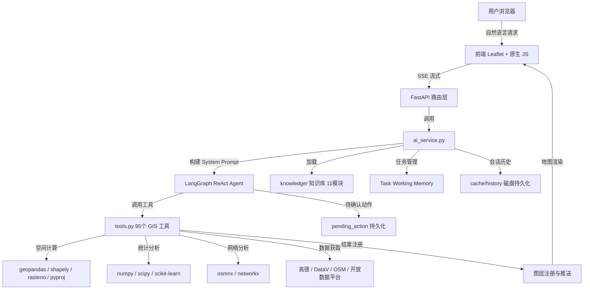
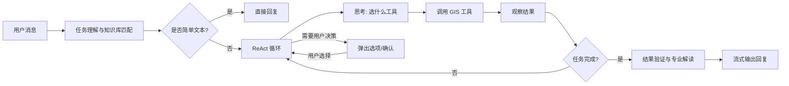

<p align="center">
  
</p>

<p align="center">
  <b>AI 驱动的智能 GIS 工作平台</b>
</p>

<p align="center">
  
  
  
  
  
  
</p>

> 项目持续开发中，部分功能仍在测试，可能存在已知或未发现的 Bug。使用前请阅读免责声明。

---

## 项目简介

GIS-WORKTABLE 是一个面向 GIS 专业人员的 AI 智能工作平台。它将 AI Agent、GIS 专业知识库、空间分析工具链和自动化工作流整合为一体，让用户通过自然语言即可完成空间数据获取、坐标转换、空间分析、遥感指数计算、地图制图和分析报告生成。

与传统 GIS 软件相比，GIS-WORKTABLE 的核心差异在于：用户不需要记住复杂的工具菜单和参数配置，只需用自然语言描述需求，AI Agent 会自动理解任务、规划分析流程、调用专业 GIS 工具执行，并对结果给出专业解读。

**目标用户**：GIS 分析师、遥感工程师、城市规划师、地理数据科学家、需要处理空间数据的研究人员和开发者。

---

## 核心功能

### AI Agent 智能助手
- 自然语言 GIS 需求解析：自动识别分析目标、数据需求和方法选择
- 任务规划：复杂任务自动分解为数据准备、数据检查、方法选择、工具调用、结果验证、结果展示的完整流程
- 95 个专业 GIS 工具调用：覆盖矢量分析、栅格处理、空间统计、网络分析、数据获取等领域
- 多轮上下文记忆：支持 Task Working Memory、会话历史、中间结果管理和长任务执行
- 结果专业解读：对分析结果给出统计数据、空间分布特征和方法局限性说明
- 两阶段数据源选择：下载数据前先让用户选数据源（带配置状态），搜索后再让用户选具体数据

### GIS 专业知识库
- 11 个结构化知识模块：GIS 基础、坐标系与投影、矢量处理、栅格处理、空间分析、空间统计、遥感分析、DEM 地形分析、地图制图规范、常见 GIS 项目工作流
- 每个模块包含适用场景、输入数据要求、分析思路、处理流程、方法选择依据、推荐工具、输出结果、常见问题
- Agent 自动路由匹配：根据用户任务自动加载相关知识模块，辅助方法选择和参数决策

### 空间分析工具链
- 矢量分析：缓冲区、多环缓冲区、叠加分析（相交/联合/差集/裁剪）、融合、简化、质心、空间连接、要素选择、采样、邻近分析、聚类分析、Voronoi 图、字段统计
- 编辑操作：移动、旋转、缩放、顶点编辑、添加字段、删除字段、更新属性、删除要素
- 坐标转换：坐标系转换、坐标批量转换
- 数据质量：几何有效性批量修复、重复要素检测、拓扑检查

### 栅格与遥感分析
- 遥感指数：NDVI（归一化植被指数）、NDWI（归一化水体指数）、NDBI（归一化建筑指数）、EVI（增强型植被指数）、NDMI（归一化水分指数）
- 栅格计算：自定义栅格计算器、栅格裁剪、空间插值
- DEM 地形分析：高程分析、地形剖面、等高线提取、三维地形查看

### 空间统计
- 全局空间自相关（Moran's I）：判断空间数据是否存在聚集模式
- 局部空间自相关与热点分析（Getis-Ord Gi*）：识别热点和冷点区域
- 核密度估计（KDE）：分析点要素的空间分布密度

### 网络分析
- 路径规划：基于 OSM 路网的最短路径计算
- 服务区分析：网络可达范围计算
- 路网下载：按区域自动下载 OpenStreetMap 道路网络

### 数据获取与连接器
- 高德地图：POI 搜索、地理编码、逆地理编码、批量地理编码
- DataV：行政区划边界获取
- 开放数据发现与下载：自动检索公开 GIS 数据源（道路、建筑、POI、水系、土地利用、遥感影像、DEM 等）并下载加载
- 连接器管理：支持 11 个数据平台的账号配置（Copernicus、USGS、地理空间数据云、NASA Earthdata、OpenTopography、ASF、天地图、资源环境数据云等），配置状态实时可见

### 地图制图与可视化
- 分级色彩图、唯一值图、热力图、统计图表（柱状图、折线图等）
- 图例、标注、指北针添加
- 地图导出为图片或 PDF
- 时间动画、图表地图联动

### 工程与项目管理
- 工程保存/加载/重命名/删除/导出/导入
- 图层管理：添加、删除、显隐控制、属性查看、导出 Shapefile
- 分析报告自动生成：包含方法、参数、结果统计和结论的 Markdown 报告

---

## 技术架构


```mermaid
graph TB
    User[用户浏览器] -->|自然语言请求| Frontend[前端 Leaflet + 原生 JS]
    Frontend -->|SSE 流式| API[FastAPI 路由层]
    API -->|调用| AIService[ai_service.py]
    AIService -->|构建 System Prompt| Graph[LangGraph ReAct Agent]
    AIService -->|加载| KB[knowledge/ 知识库 11模块]
    Graph -->|调用工具| Tools[tools.py 95个 GIS 工具]
    Tools -->|空间计算| GeoStack[geopandas / shapely / rasterio / pyproj]
    Tools -->|统计分析| StatsStack[numpy / scipy / scikit-learn]
    Tools -->|网络分析| NetworkStack[osmnx / networkx]
    Tools -->|数据获取| DataSources[高德 / DataV / OSM / 开放数据平台]
    Tools -->|结果注册| LayerState[图层注册与推送]
    LayerState -->|地图渲染| Frontend
    Graph -->|待确认动作| PendingAction[pending_action 持久化]
    AIService -->|任务管理| TaskManager[Task Working Memory]
    AIService -->|会话历史| History[cache/history 磁盘持久化]
```

### 模块说明

| 模块 | 位置 | 职责 |
|------|------|------|
| 前端 | `frontend/` | Leaflet 地图、聊天界面、图层管理、设置面板、工程管理 |
| API 层 | `backend/main.py` | FastAPI 路由、静态文件服务、文件上传、工程管理接口 |
| AI 服务 | `backend/services/ai_service.py` | System Prompt 构建、知识库路由、会话管理、流式响应 |
| Agent 引擎 | `backend/services/graph.py` | LangGraph ReAct 循环、工具调用、简单文本短路 |
| GIS 工具 | `backend/services/tools.py` | 95 个 @tool 函数，覆盖全部 GIS 能力 |
| 知识库 | `knowledge/` | 11 个结构化 GIS 知识模块 |
| 任务管理 | `backend/services/task_manager.py` | Task Working Memory、代码/产物/执行日志 |
| 待确认动作 | `backend/services/pending_action.py` | 跨轮 pending 状态、选项确认、磁盘持久化 |
| 开放数据 | `backend/services/data_discovery.py` | 开放 GIS 数据源检索与下载 |

### AI Agent 内部流程


```mermaid
graph LR
    A[用户消息] --> B[任务理解与知识库匹配]
    B --> C{是否简单文本?}
    C -->|是| D[直接回复]
    C -->|否| E[ReAct 循环]
    E --> F[思考: 选什么工具]
    F --> G[调用 GIS 工具]
    G --> H[观察结果]
    H --> I{任务完成?}
    I -->|否| E
    I -->|是| J[结果验证与专业解读]
    J --> K[流式输出回复]
    E -->|需要用户决策| L[弹出选项/确认]
    L -->|用户选择| E
```

---

## 工作流程

```
用户输入自然语言需求
    ↓
AI 理解任务，匹配知识库模块
    ↓
规划分析流程（数据准备 → 检查 → 方法选择 → 工具调用 → 验证 → 展示）
    ↓
调用 GIS 工具执行（可多轮工具调用）
    ↓
需要用户决策时弹出选项（数据源选择 / 数据选择 / 确认加载）
    ↓
生成地图、图表、分析报告
    ↓
AI 给出专业解读（统计数据、空间分布、方法局限性）
```

---

## 技术栈

**后端**
- Python 3.11+
- FastAPI + Uvicorn
- LangGraph 1.x + LangChain 1.x（AI Agent 引擎）
- geopandas、shapely、rasterio、pyproj、pyogrio（GIS 核心库）
- numpy、scipy、scikit-learn、pandas（数值与统计）
- osmnx、networkx（网络分析）
- matplotlib、seaborn、pyecharts（可视化）
- Pillow、scikit-image（图像处理）

**前端**
- 原生 HTML / CSS / JavaScript（无构建工具）
- Leaflet（交互式地图）
- Marked.js（Markdown 渲染）

**AI 模型**
- 兼容 OpenAI 接口的任意模型（DeepSeek、GLM、Qwen 等）
- 用户在设置中自行配置 API Key 和 Base URL

**工程化**
- Docker + docker-compose
- GitHub Actions CI（pytest 自动化测试）
- pytest（410 项测试）

---

## 项目结构

```
Gis-WorkTable/
├── backend/
│   ├── main.py                  # FastAPI 入口，路由与静态文件
│   ├── requirements.txt         # Python 依赖
│   ├── pytest.ini               # 测试配置
│   ├── services/
│   │   ├── ai_service.py        # AI 服务：System Prompt、知识库、会话管理
│   │   ├── graph.py             # LangGraph ReAct Agent 循环
│   │   ├── tools.py             # 95 个 GIS 工具函数
│   │   ├── task_manager.py      # Task Working Memory
│   │   ├── pending_action.py    # 跨轮待确认动作与选项
│   │   ├── data_discovery.py    # 开放数据发现与下载
│   │   └── ...
│   └── tests/                   # pytest 测试（410 passed）
├── frontend/
│   ├── index.html               # 单页应用入口
│   ├── css/style.css            # 样式
│   └── js/                      # 15 个前端模块
│       ├── chat.js              # 聊天与 SSE 流式接收
│       ├── layers.js            # 图层管理
│       ├── map.js               # 地图操作
│       ├── settings.js          # 设置面板
│       ├── spatial.js           # 空间分析面板
│       ├── spatial_stats.js     # 空间统计面板
│       ├── connector.js         # 连接器快捷入口
│       ├── project.js           # 工程管理
│       └── ...
├── knowledge/                   # GIS 专业知识库（11 模块）
│   ├── 00_index.md
│   ├── 01_gis_basics.md
│   ├── 02_coordinate_systems.md
│   ├── 03_vector_processing.md
│   ├── 04_raster_processing.md
│   ├── 05_spatial_analysis.md
│   ├── 06_spatial_statistics.md
│   ├── 07_remote_sensing.md
│   ├── 08_dem_terrain.md
│   ├── 09_cartography.md
│   └── 10_workflows.md
├── docs/                        # 项目文档
├── skills/                      # 可复用 Skill
├── cache/                       # 会话历史与 pending 状态
├── data/                        # 下载的数据文件
├── reports/                     # 生成的分析报告
├── .github/workflows/ci.yml     # GitHub Actions CI
├── Dockerfile                   # Docker 镜像
├── docker-compose.yml           # Docker Compose 配置
├── start.bat                    # Windows 一键启动
└── README.md
```

---

## 安装与运行

### 环境要求
- Python 3.11 或更高版本
- 推荐 8GB 以上内存（空间分析和栅格处理较为消耗资源）
- 一个兼容 OpenAI 接口的 AI 模型 API Key

### 方式一：一键启动（Windows）

```bat
start.bat
```

脚本会自动安装依赖并启动后端服务。

### 方式二：手动启动

```bash
# 1. 克隆项目
git clone https://github.com/Wukeeeeee/GIS-WORKTABLE.git
cd GIS-WORKTABLE

# 2. 安装 Python 依赖
pip install -r backend/requirements.txt

# 3. 启动后端
cd backend
uvicorn main:app --host 127.0.0.1 --port 8000 --reload
```

### 方式三：Docker

```bash
docker-compose up --build
```

### 访问

启动后在浏览器打开：`http://127.0.0.1:8000`

### 配置 AI 模型

1. 点击页面左下角模型选择器旁边的设置按钮
2. 在「AI 模型」页签中添加 Provider（名称、API Key、Base URL、模型名称）
3. 选中该 Provider 即可开始使用
4. API Key 保存在浏览器 localStorage，不会上传到服务器

### 配置数据源连接器

1. 点击输入框旁的连接器图标，或进入设置 → 连接器
2. 配置需要使用的数据平台账号（Copernicus、USGS、地理空间数据云等）
3. 配置状态会在 AI 下载数据时的数据源选择中显示

---

## 使用示例

### 示例 1：缓冲区分析

**用户输入**：
```
对广州塔周边 2 公里范围内的 POI 做缓冲区分析
```

**执行流程**：
1. AI 调用高德地理编码获取广州塔坐标
2. 调用高德 POI 搜索获取周边 POI
3. 调用 spatial_buffer 工具生成 2 公里缓冲区
4. 调用 spatial_intersect 统计缓冲区内 POI 数量
5. 渲染缓冲区和 POI 到地图

**输出结果**：地图显示缓冲区范围和 POI 分布，AI 回复包含 POI 数量统计和空间分布特征。

### 示例 2：遥感指数计算

**用户输入**：
```
计算这个区域的 NDVI 植被指数
```

**执行流程**：
1. AI 检查当前图层是否为多波段栅格
2. 调用 ndvi_analysis 工具计算 NDVI
3. 生成 NDVI 伪彩色图
4. 统计植被覆盖等级分布

**输出结果**：NDVI 热力图 + 植被覆盖统计 + 方法说明。

### 示例 3：空间统计热点分析

**用户输入**：
```
分析这些犯罪事件的空间聚集模式，找出热点区域
```

**执行流程**：
1. AI 调用 spatial_moran 计算全局 Moran's I，判断是否存在聚集
2. 调用 spatial_hotspot 计算 Getis-Ord Gi*，识别热点和冷点
3. 渲染热点图

**输出结果**：热点分布图 + Moran's I 统计值 + 显著性解释。

### 示例 4：路径规划

**用户输入**：
```
从广州东站到广州塔的最短驾车路线
```

**执行流程**：
1. AI 调用 download_road_network 下载区域路网
2. 调用 network_analysis 计算最短路径
3. 渲染路线到地图

**输出结果**：地图显示最优路线 + 距离和预计时间。

### 示例 5：数据下载（两阶段选择）

**用户输入**：
```
帮我下载广州的 Sentinel-2 遥感影像
```

**执行流程**：
1. AI 调用 ask_user_choice 弹出数据源选项（显示各数据源配置状态）
2. 用户选择数据源后，AI 搜索可用影像
3. AI 再次调用 ask_user_choice 弹出候选影像列表（日期、云量、分辨率）
4. 用户选择后，AI 下载并加载到地图

**输出结果**：遥感影像加载到地图 + 数据元信息说明。

---

## 开发说明

### 运行测试

```bash
cd backend
python -m pytest tests/ -v
```

当前测试覆盖：知识库加载、空间分析工具、栅格工具、网络分析、空间统计、遥感指数、报告质量、多轮状态、任务管理等，共 410 项测试通过。

### 新增 GIS 工具

1. 在 `backend/services/tools.py` 中添加 `@tool` 装饰的函数
2. 函数 docstring 需包含适用场景、输入要求、输出说明、常见问题
3. 将工具名加入 `tools` 列表
4. 添加对应测试用例

### 新增知识模块

1. 在 `knowledge/` 目录下添加 Markdown 文件
2. 在 `ai_service.py` 的 `_KNOWLEDGE_MAP` 中注册路由标签
3. 模块需包含适用场景、输入要求、分析思路、处理流程、方法选择依据、推荐工具、输出结果、常见问题

### 调试

- 后端日志：控制台实时输出
- AI 执行步骤：聊天界面中可展开「思考过程」和工具调用日志
- 会话历史：`cache/history/` 目录
- 任务文件：`cache/tasks/` 目录

---

## 最近更新

- 新增 GIS 专业知识库（11 个结构化模块，Agent 自动路由匹配）
- AI Agent 能力升级：任务规划流程、结果专业解读、方法选择决策树
- 新增空间统计工具：Moran's I 全局/局部自相关、Getis-Ord Gi* 热点分析、核密度估计
- 新增遥感指数工具：NDWI、NDBI、EVI、NDMI
- 新增分析报告自动生成、几何修复、重复要素检测工具
- 新增两阶段数据源选择机制（ask_user_choice + choose_option）
- 新增连接器管理面板（11 个数据平台账号配置）
- 新增消息引用功能（引用 AI 回复继续对话）
- 新增空间统计前端面板
- 新增 Docker 支持和 GitHub Actions CI
- 新增 Windows 一键启动脚本
- 取消自校验环节（减少一次 LLM 调用，提升响应速度）
- 优化简单文本响应速度（短路机制，避免简单问题走 ReAct 循环）

**注意**：以上部分功能仍在测试中，可能存在 Bug。

---

## 未来规划

- 更多遥感数据源的自动下载支持（需要用户配置对应平台账号）
- 空间建模与时空分析能力
- 插件系统，支持第三方工具扩展
- 多人协作与工程分享
- 移动端适配
- 更完善的错误恢复与任务断点续传

---

## 免责声明

本项目处于持续开发阶段，可能存在已知或未发现的 Bug、功能缺陷或性能问题。GIS 分析结果仅供参考，不构成任何专业决策依据。对于因使用本软件导致的任何直接或间接损失，项目开发者不承担责任。

使用本软件进行空间分析时，请注意：
- 分析结果的准确性取决于输入数据质量和方法选择的合理性
- 坐标转换和空间计算可能存在精度误差
- 第三方数据平台的账号配置和下载行为需遵守对应平台的使用条款
- AI 生成的分析解读不替代专业 GIS 人员的判断

---

## License

AGPL-3.0
