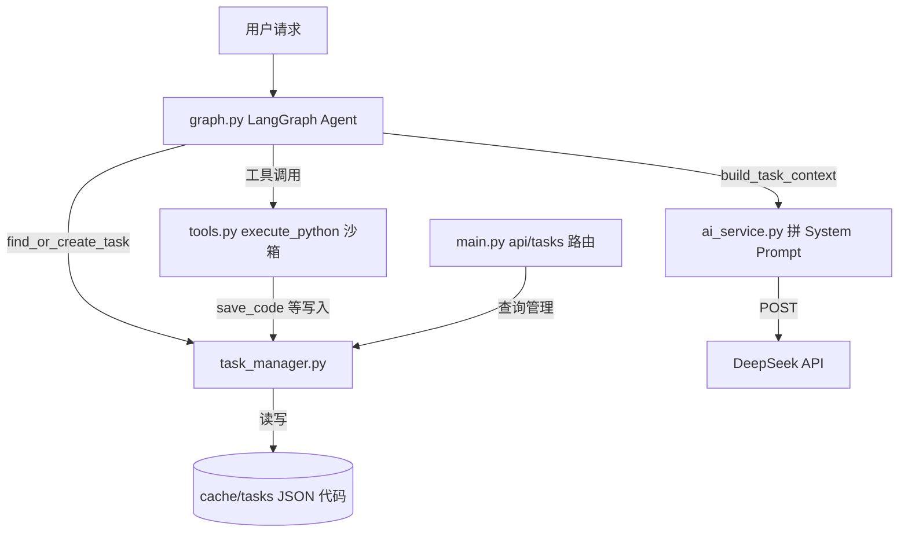

# TaskManager 模块说明

`backend/services/task_manager.py`

> 纯函数模块，无 Class。为 Agent 提供任务级工作记忆：持久化沙箱代码版本、执行记录与产物档案，并在下一轮对话注入 LLM。


***

## 1. 这个模块是什么

**定位**：Agent 的 "任务工作记忆" 层。位于 AI Service 与沙箱执行器之间，负责把每次 `execute_python` 产生的代码、执行结果、产物登记到本地磁盘，并在后续轮次把这些上下文拼回 System Prompt。

**负责**：


* 任务的创建、查找、归档、删除

* 沙箱代码的版本化存储（step_001.py → latest.py）

* 执行记录的追加与查询

* 产物（图片等）的档案登记（仅元信息）

* 任务上下文的文本化（供 LLM 读取）

**不负责**：


* 不执行代码（执行在 `tools.py:execute_python`）

* 不管理 "当前任务" 全局状态（`set_current_task` / `get_current_task_id` 在 `tools.py`）

* 不复制 / 保管产物文件本体（图片留在系统临时目录）

* 不提供前端 UI（前端任务卡是 `frontend/js/task.js` + localStorage 的独立实现）

**为什么需要**：LLM 本身无状态，多轮对话中 Agent 生成的沙箱代码若不持久化，下一轮就无法延续。本模块用本地文件系统做轻量持久化，让 Agent 能 "记得上一步写了什么、跑成什么样"。


***

## 2. 在项目中的位置





***

## 3. 核心结构

### 模块级变量


| 名称          | 类型             | 作用                                |
| ----------- | -------------- | --------------------------------- |
| `_BASE_DIR` | str            | 存储根目录 `cache/tasks/`（:29）         |
| `_lock`     | threading.Lock | 所有写操作的线程锁（:33）                    |
| `_tasks`    | dict           | 内存任务缓存（task_id → task dict），磁盘兜底 |

### 任务数据结构（task.json）


```
{

  "task_id": "12位hex",

  "user_goal": "用户原始目标",

  "session_id": "default",

  "status": "active | archived",

  "current_step": 3,

  "latest_code_version": 3,

  "gis_context": {},

  "created_at": "...",

  "updated_at": "..."

}
```

### 磁盘布局


```
cache/tasks/<task_id>/

├── task.json         任务元数据

├── code/

│   ├── step_001.py   每次执行的代码版本（失败也存）

│   ├── latest.py     最新代码副本

│   └── metadata.json 版本 label（可选）

├── artifacts.json    产物档案卡列表

└── exec_log.json     执行记录列表
```

### 关键函数（按职责分组）


| 分组          | 函数                                                                 | 作用                          | 调用方                              |
| ----------- | ------------------------------------------------------------------ | --------------------------- | -------------------------------- |
| **入口**      | `find_or_create_task()`                                            | 找活跃任务，没有就建                  | graph.py（每轮对话）                   |
|             | `find_active_task_for_session()`                                   | 按 session 查活跃任务             | find_or_create_task 内部        |
| **任务管理**    | `create_task()`                                                    | 新建任务并落盘                     | find_or_create_task           |
|             | `get_task()`                                                       | 取任务（内存优先，磁盘兜底，有写缓存副作用）      | main.py/ 内部                      |
|             | `update_task()`                                                    | 改任务字段（仅内存中已有的）              | archive/restore 内部               |
|             | `archive_task()` / `restore_task()`                                | 归档 / 恢复                     | main.py                          |
|             | `delete_task()`                                                    | 删任务及文件                      | main.py / ai_service.py         |
|             | `list_tasks()`                                                     | 任务列表                        | main.py                          |
|             | `task_snapshot()`                                                  | 任务快照（不含 code/artifacts/log） | main.py                          |
| **代码缓存**    | `save_code()`                                                      | 存代码版本，返回 step 号             | tools.py（沙箱）                     |
|             | `get_latest_code()` / `get_code_version()` / `get_code_versions()` | 读代码                         | main.py / ai_service.py         |
| **产物登记**    | `register_artifact()`                                              | 登记产物档案卡（不复制文件）              | tools.py（沙箱）                     |
|             | `get_artifacts()` / `get_artifact()` / `get_artifact_summary()`    | 读产物                         | main.py / build_task_context   |
|             | `verify_artifact()`                                                | 校验产物文件是否仍存在                 | **死代码，无调用**                      |
| **执行日志**    | `log_execution()`                                                  | 追加一条执行记录                    | tools.py（沙箱）                     |
|             | `get_exec_log()` / `get_exec_log_summary()`                        | 读日志                         | main.py / build_task_context   |
| **上下文注入**   | `build_task_context()`                                             | 拼任务上下文文本                    | ai_service.py（注入 System Prompt） |
| **GIS 上下文** | `update_gis_context()` / `get_gis_context()`                       | GIS 工作记忆                    | **死代码，无调用**                      |
| **辅助**      | `_guess_mime()` / `_guess_type()`                                  | 扩展名查表                       | register_artifact 内部            |
|             | `_new_task()` / `_new_artifact()` / `_new_exec_record()`           | 构造 dict                     | 各公共函数内部                          |
|             | `_save_*_to_disk()` / `_load_*_from_disk()`                        | 磁盘 IO                       | 各公共函数内部                          |


***

## 4. 核心流程（任务生命周期）


```
用户发消息

  ↓

graph.py 每轮对话调用 find_or_create_task(session_id, user_message)

  ├─ 有活跃任务 → 复用 task_id

  └─ 无活跃任务 → create_task() 新建（写 task.json + 空 artifacts.json + 空 exec_log.json）

  ↓

graph.py 调用 tools.py 的 set_current_task(task_id)  ← 注意：此函数在 tools.py，不在本模块

  ↓

Agent 决定调用 execute_python(code)

  ↓

tools.py 沙箱内：

  ① save_code(task_id, code)          → 写 code/step_NNN.py + latest.py + 更新 task.json（current_step+1）

  ② 执行代码（subprocess）

  ③ log_execution(task_id, step, ...) → 追加 exec_log.json（成功/失败/超时/异常各一条）

  ④ register_artifact(...)            → 仅当生成图片时，追加 artifacts.json

  ↓

下一轮对话

  ↓

ai_service.py 调用 build_task_context(task_id)

  → 读 task.json + latest.py + exec_log.json + artifacts.json

  → 拼成文本，追加到 System Prompt

  → POST 给 LLM，模型"记得"上一轮
```


***

## 5. 函数调用关系

### 主链路（写入）


```
find_or_create_task()

  └─→ create_task()

        └─→ _new_task() + _save_task_to_disk() + _save_artifacts_to_disk([]) + _save_exec_log_to_disk([])

save_code()                          ← tools.py 调用

  └─→ _save_task_to_disk()           （更新 current_step）

log_execution()                      ← tools.py 调用

  └─→ _load_exec_log_from_disk() → append → _save_exec_log_to_disk()

register_artifact()                  ← tools.py 调用

  └─→ _new_artifact() → _load_artifacts_from_disk() → append → _save_artifacts_to_disk()
```

### 主链路（读取 / 注入）


```
build_task_context()                 ← ai_service.py 调用

  ├─→ get_task()

  ├─→ get_latest_code()

  ├─→ get_exec_log_summary()

  └─→ get_artifact_summary()
```

### 管理链路（HTTP API）


```
main.py /api/tasks 路由

  ├─→ list_tasks()

  ├─→ get_task() + task_snapshot() + get_code_versions() + get_artifacts() + get_exec_log() + get_latest_code()

  ├─→ get_code_version() / get_latest_code()

  ├─→ archive_task() → update_task(status="archived")

  ├─→ restore_task() → update_task(status="active")

  └─→ delete_task()
```


***

## 6. 与其他模块的关系


| 模块                            | 关系                                            | 具体调用                                                                                                            |
| ----------------------------- | --------------------------------------------- | --------------------------------------------------------------------------------------------------------------- |
| **graph.py**（LangGraph Agent） | 上游：每轮对话创建 / 复用任务                              | `find_or_create_task()`（:282 非流式 / :528 流式）                                                                     |
| **tools.py**（沙箱执行器）           | 下游：执行中写入代码 / 日志 / 产物                          | `save_code()`（:870）、`log_execution()`（:882/999/1039/1048/1088/1108/1119/1127）、`register_artifact()`（:1033/1102） |
| **ai_service.py**（AI 服务）     | 下游：读取并注入 LLM                                  | `build_task_context()`（:678）、`delete_task()`（:932，清记忆时）                                                         |
| **main.py**（FastAPI 路由）       | 旁路：HTTP 查询 / 管理                               | `/api/tasks` 系列 6 个路由（:1099-1155）                                                                               |
| **frontend/js/task.js**       | **无关系**：前端任务卡是 localStorage 独立实现，不调用本模块任何 API | —                                                                                                               |

> 注意：
> `set_current_task()`
> /
> `get_current_task_id()`
> 定义在
> `tools.py`
> ，不在本模块。本模块只提供 "按 task_id 存取"，不维护 "当前是哪个任务" 的全局状态。


***

## 7. 一个完整任务的生命周期（典型路径）


```
用户："帮我提取天河区水体"

  → graph.py:528  find_or_create_task("default", "帮我提取天河区水体")

    → 无活跃任务 → create_task() → task_id=765404ef0017，写 task.json

  → graph.py:529  set_current_task("765404ef0017")  （tools.py 全局变量）

  → Agent 调用 execute_python(代码)

    → tools.py:870  save_code("765404ef0017", code) → step_032.py + latest.py + task.json(current_step=32)

    → 执行失败（沙箱拦截）

    → tools.py:882  log_execution(..., "failed", stderr="沙箱拦截...") → exec_log.json

  → Agent 重试，调用 execute_python(新代码)

    → tools.py:870  save_code(...) → step_042.py + latest.py + task.json(current_step=42)

    → 执行成功，生成图片

    → tools.py:1033 register_artifact(图片) → artifacts.json

    → tools.py:1039 log_execution(..., "success") → exec_log.json

  → Agent 输出结果给用户

下一轮用户："接着优化"

  → graph.py:528  find_or_create_task → 找到活跃任务 765404ef0017（复用）

  → ai_service.py:678  build_task_context("765404ef0017")

    → 读 task.json + latest.py(step_042) + exec_log.json + artifacts.json

    → 拼成"## 当前任务...上一轮代码...执行历史...已生成文件"

    → 追加 System Prompt → POST LLM

  → LLM 看到上一轮代码和结果，继续优化
```


***

## 8. 阅读代码的推荐顺序


1. **先看模块顶部**（:1-35）：`_BASE_DIR`、`_lock`、路径辅助函数（`_task_dir` 等）—— 建立存储模型

2. **看构造函数**（:67-125）：`_new_task` / `_new_artifact` / `_new_exec_record`—— 理解三种数据结构

3. **看磁盘 IO**（:128-183）：`_save_*_to_disk` / `_load_*_from_disk`—— 理解持久化方式（全量覆盖写）

4. **看任务入口**（:556-585）：`find_or_create_task` / `find_active_task_for_session`—— 任务怎么来的

5. **看核心写入**（:282-329 save_code、:443-465 log_execution、:370-401 register_artifact）—— 沙箱执行时写什么

6. **看上下文注入**（:513-553）：`build_task_context`—— 数据怎么回到 LLM

7. **看管理 API**（:187-275 + :625-642）：create/get/update/archive/delete/list/task_snapshot——HTTP 层用什么

8. **最后看辅助**（:587-622 `_guess_mime`/`_guess_type`、:490-510 GIS 上下文死代码）


***

## 已知注意点


* `/api/tasks`** 系列路由当前无前端调用者 **：前端任务卡（`frontend/js/task.js`）基于 localStorage，与本模块完全独立，两套任务系统未打通。

* **产物文件本体不在任务目录**：`artifacts.json` 只存路径指针，图片本体在系统临时目录 `gis_worktable_output/`，可能被清理（`verify_artifact` 用于检测悬空指针，但该函数当前无调用）。

* **死代码**：`verify_artifact()`（:418）、`update_gis_context()` / `get_gis_context()`（:490-510）无任何调用方。

* **写入策略**：所有 JSON 为 "读全量 → 改 → 写全量" 覆盖模式，单任务数据量小，够用；任务数或日志量大后需关注性能。

* `get_task()`** 有写副作用 **：磁盘读到任务后会写回内存缓存 `_tasks`，不是纯读函数。